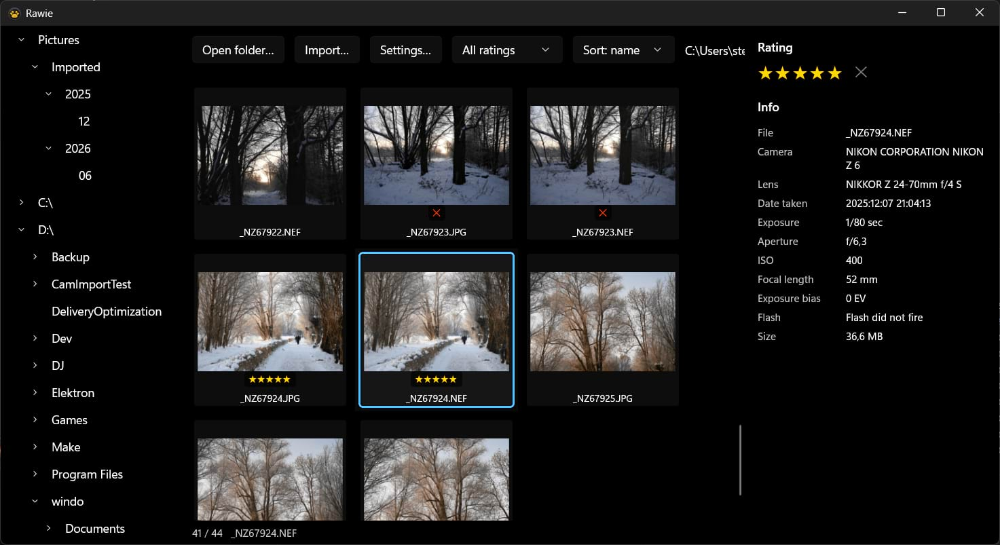

<div align="center">


# RAWimp

**A fast photo browser, culler and image importer for Windows.**

Built for camera RAW files, with the Windows shell woven through it.



</div>

## Features

### Browse
- Virtualised thumbnail grid that stays smooth in folders of thousands of photos
- **RAW support** — NEF, DNG, CR2/CR3, ARW, RAF, ORF, RW2, PEF, X3F, alongside JPEG, HEIC, TIFF and PNG
- Folder tree covering your drives, Pictures, and any connected camera, resizable and remembered
- Large preview with a keystroke, and neighbouring photos ready before you reach them
- Videos are listed with poster frames and open in your own player
- **Thumbnail cache on disk** — a revisited RAW folder loads about 4× faster and never re-decodes the RAW

### Inspect
- EXIF panel: camera, lens, exposure, aperture, ISO, focal length, date taken, GPS, dimensions

### Cull
- **Star ratings and reject flags**, by keyboard or by clicking the stars
- Written to **XMP sidecars** — the same files Adobe Bridge and Lightroom read, so ratings travel with
  your photos. Your originals are never modified
- A RAW+JPEG pair shares one rating, because it's one photo
- **Filter** to just your picks or just the rejects, and **sort** by rating
- Multi-select, then rate, move or delete the whole batch in one action
- Delete, rename and move run through the Windows shell, so they land in the **Recycle Bin**, show
  Explorer's progress, and **undo with Ctrl+Z in Explorer**

### Import
- Copies from **memory cards and cameras connected over MTP** — cameras that have no drive letter and
  only appear in Explorer work too
- Destination folders and filenames come from a **pattern you write**, filled in from each photo's
  own metadata
- **Live preview** of exactly where files will land, updating as you type the pattern
- Every copy is **verified by checksum**, and photos already imported are skipped by content — so
  re-inserting a card is quick and safe
- Choose whether an existing file is kept alongside, skipped, or overwritten
- Interrupted transfers say so honestly, with the real number of files copied

### Explorer integration
- **The genuine Windows context menu** on photos, folders and drives — including your installed shell
  extensions (7-Zip, PowerToys, and the rest)
- **Drag photos out** to Explorer, the desktop or any other app; ratings come along
- **Drop files in** from other apps, onto any folder or into the current one
- Cameras and cards appear and disappear as you plug them in
- The view refreshes itself when anything changes on disk

## Keyboard

| Key | Action |
|---|---|
| `←` `→` `↑` `↓` | Move between photos |
| `Home` `End` `PgUp` `PgDn` | Jump around the folder |
| `Enter` | Open the preview, or open the selected folder |
| `Esc` | Leave the preview |
| `1`–`5` | Rate · `0` clears |
| `X` | Toggle reject |
| `Del` | Send to the Recycle Bin |
| `F2` | Rename |
| `Ctrl`+`M` | Move to another folder |
| `Ctrl`+`O` | Open in the default external app |
| `Ctrl`+`A` | Select all |
| `Tab` | Switch between the folder tree and the grid |
| `Menu` | Windows context menu for the selection |

## Getting started

Requires **Windows 10 build 19041 or newer (x64)** and the [.NET 10 SDK](https://dotnet.microsoft.com/download).
Installing the **Raw Image Extension** from the Microsoft Store lets Windows produce thumbnails for
more RAW formats.

```bash
dotnet run --project src/RAWimp.App
```

To open a specific folder on launch:

```bash
dotnet run --project src/RAWimp.App -- --folder "D:\Photos\2026"
```

RAWimp opens the folder you had last time, or one you nominate in **Settings**.

## Where things are kept

| What | Where |
|---|---|
| Ratings | `<photo>.xmp`, beside each photo |
| Thumbnail cache | `%LOCALAPPDATA%\RAWimp\thumbs` — disposable, clearable from Settings |
| Settings | `%LOCALAPPDATA%\RAWimp\settings.json` |

## Development

Build and test:

```bash
dotnet build RAWimp.slnx
```

```bash
dotnet run --project tests/RAWimp.Tests
```

The tests compile the real source files rather than copies, and cover sidecar reading and writing,
the rule that stops a RAW+JPEG partner losing its rating, destination patterns, and the import
copy/verify/dedupe path.

The app writes a running log to **`startup.log`** next to the built executable — the first place to
look when something misbehaves in a GUI that can't tell you itself.

### Things worth knowing before changing them

- **`Vanara.Windows.Shell.ShellContextMenu` corrupts the process heap** on first use, and the crash
  only surfaces at the next GC. `ShellMenu.cs` uses the classic
  `IShellFolder`→`IContextMenu`→`TrackPopupMenuEx` path instead.
- **Thumbnail decoding is serialised.** Concurrent decodes of RAW thumbnails crash the Windows RAW
  codec, which takes WinUI down with it.
- **MTP devices serve one transfer at a time**, and only release it once the stream's COM wrapper is
  collected — hence the explicit release in `ImportEngine`, without which every file after the first
  fails as "device busy".
- **Assign `ItemsSource` a whole new list** per folder. Adding items one at a time to a bound
  collection corrupts the virtualiser during fast folder switching.
- **Decode outside the XAML pipeline.** `BitmapImage.SetSourceAsync` decodes inside XAML and crashes
  if a container recycles mid-decode; `BitmapDecoder` → `WriteableBitmap` is safe.
- **Bound-mode `TreeView`** ignores `SelectedItem` and `RootNodes` for programmatic control — drive it
  through `IsExpanded`/`IsSelected` bindings on your own model.
- **Never write into the user's originals.** Ratings go to sidecars; file operations go through the
  shell so they stay undoable.
